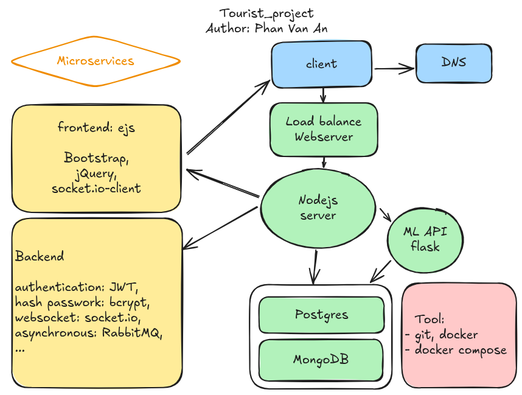

# Tourist Project

## Overview
The **Tourist Project** is a scalable web application designed to enhance the travel experience by providing a platform for exploring destinations, managing user profiles, and enabling social interactions. Built as a microservices architecture, this project showcases a robust backend, responsive frontend, and real-time features, making it an ideal portfolio piece for demonstrating full-stack development skills.

<p align="center">
  
</p>

<p align="center">
  <em>Sơ đồ hệ thống tổng quan của dự án Tourist</em>
</p>

## Features
- **Destination Management:** CRUD operations for popular Vietnamese travel destinations (e.g., Phú Quốc, Nha Trang, Đà Nẵng) with detailed information including descriptions, images, and maps.
- **User Profiles:** Personalized user accounts with profile creation, editing, and authentication using JWT (JSON Web Tokens).
- **Social Interaction:** Features like comments, likes, and real-time chat using WebSocket technology.
- **Explore:** A social feed where users can discover and view posts shared by other travelers, fostering community engagement and inspiration.
- **Recommendations:** Smart destination suggestions based on user activity.

## Tech Stack
- **Frontend:** 
  - Framework: EJS
  - Libraries: Bootstrap, jQuery, socket.io-client
- **Backend:** 
  - Framework: Node.js, flask
  - Authentication: JWT, bcrypt
  - Real-time: socket.io, RabbitMQ for asynchronous tasks
  - Webserver: Nginx
- **Database:** 
  - PostgreSQL: For structured data (e.g., user profiles, hash_password)
  - MongoDB with Mongoose: For flexible data storage (e.g., destinations)
- **Infrastructure:** Ubuntu, Docker, Docker Compose, Git
- **Deployment:** AWS EC2 (optimized for microservices)

## Architecture
The project follows a **microservices architecture** to ensure scalability and maintainability:
- **Frontend Service:** Handles client-side rendering and real-time updates.
- **Backend Service:** Manages API endpoints, authentication, and business logic.
- **Database Layer:** Separates PostgreSQL and MongoDB for different data needs.
- **Load Balancing:** Integrated with a web server to distribute traffic efficiently.

## Installation
1. **Clone the Repository:**
   ```bash
   git clone https://github.com/ANPHANVAN/tourist.git
   cd tourist
   ```
2. **Configure Environment:**
   - Create a `.env` and a `.database` file template in the `backend` directory with necessary variables (e.g., database URLs, JWT secret).
4. **Setup Database:**
   ```bash
   docker-compose up mongodb
   ```
    ```bash
    docker compose exec -it mongodb bash
    mongorestore --drop --username yourusername --password yourpassword --authenticationDatabase admin --db tourist_project /data/backup/tourist_project
    ```
3. **Run with Docker:**
   ```bash
   docker-compose up --build
   ```
5. **Access the App:**
   - Open `http://localhost` in your browser.

## Optimization and Scalability
- **Service Separation for Scalability:** Each server instance is designed to handle a single service (e.g., frontend, backend, database, caching), ensuring excellent scalability. When expanding, new servers can be added to manage specific services independently, reducing bottlenecks and enabling seamless growth.
- **Cloud Storage for Posts:** Posts can include images, which are stored on a cloud service (e.g., AWS S3). Features are linked to destinations, providing users with a comprehensive travel experience by connecting posts, comments, and destination details.
Redis Integration: Applied Redis for caching frequently accessed data (e.g., destination lists, user feeds), significantly reducing database load and optimizing system performance.
- **Responsive UX/UI:** The frontend is optimized for mobile devices, ensuring a smooth and responsive user experience across all platforms, enhancing accessibility for travelers on the go.
- **Broader Reach:** The platform is designed to support a growing user base, with localization features (e.g., Vietnamese and English languages) to attract a diverse audience of travelers.
Future-Ready Features: Prepared for additional integrations like third-party APIs (e.g., weather or booking services) to enhance functionality without impacting performance.

## Contribution
This project is a personal endeavor to explore full-stack development and microservices. Contributions are welcome! Please fork the repository, create a feature branch, and submit a pull request with detailed changes.

## Contact
- **Author:** Phan Van An
- **Email:** anphan.mainwork@gmail.com
- **LinkedIn:** [Your LinkedIn Profile](https://www.linkedin.com/in/anphanvan/)
- **GitHub:** [Your GitHub](https://github.com/ANPHANVAN)